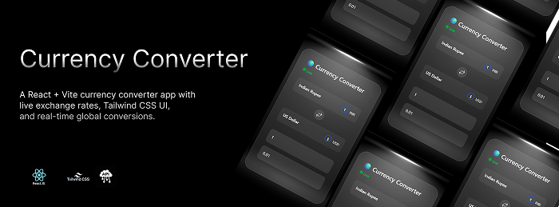
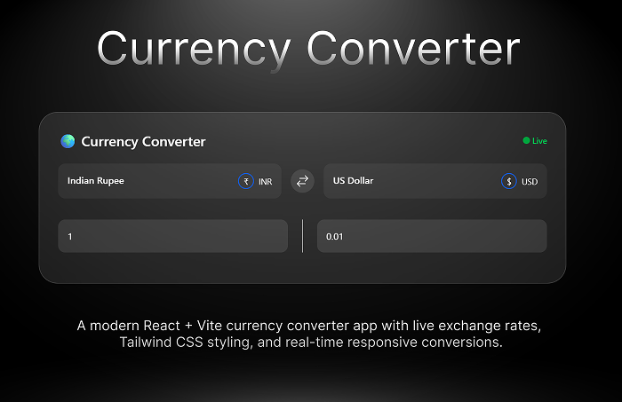

# 🌍 Currency Converter | React + Vite + Tailwind

A modern **Currency Converter Web App** built with **React**, **Vite**, and **Tailwind CSS**.  
It provides **real-time exchange rates** using [CurrencyAPI](https://currencyapi.com/) and allows quick conversion between **global currencies**.  
Perfect for **finance projects, money converters, learning React, or building modern web apps**.

---

## 🚀 Features

- 🌐 **Live exchange rates** powered by CurrencyAPI  
- 🔁 **Swap currencies** with one click  
- 💱 **Supports 150+ global currencies** (USD, EUR, GBP, INR, JPY, CAD, AUD, CNY, and more)  
- 📱 **Responsive design** for mobile, tablet, and desktop  
- 💡 **Clean modern UI** styled with Tailwind CSS  
- ⚡ **Fast & lightweight** with React + Vite  
- 📊 Ideal for **finance apps, educational projects, and money tools**  

---

## 🔧 Tech Stack

- [React](https://reactjs.org/) – Frontend UI library  
- [Vite](https://vitejs.dev/) – Fast build tool  
- [Tailwind CSS](https://tailwindcss.com/) – Utility-first CSS framework  
- [CurrencyAPI](https://currencyapi.com/) – Real-time currency data  

---

## 📸 Preview

---

## 📈 Why This Project?

This project is great if you want to:  
- Learn **React + Vite** with a practical example  
- Build a **finance app** using live APIs  
- Explore **Tailwind CSS** for responsive UIs  
- Create a **real-time currency exchange tool**  

---

“⚠️ This project uses a free CurrencyAPI key exposed for demo purposes. Please replace it with your own key if you clone the repo.”
