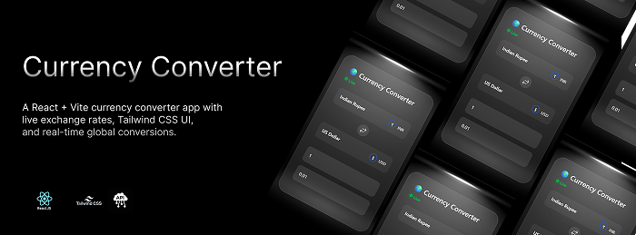

# 🌍 Currency Converter

A modern currency converter web app built with **React**, **Vite**, and **Tailwind CSS**. It uses real-time exchange rates from [CurrencyAPI](https://currencyapi.com/) to convert between global currencies quickly and accurately.

---

## 🚀 Features

- 🌐 Live exchange rates with CurrencyAPI  
- 🔁 Swap between currencies  
- 💱 Select from a wide range of global currencies  
- 💡 Clean, responsive UI  
- ⚡ Built with React + Vite for fast performance  

---

## 🔧 Tech Stack

- [React](https://reactjs.org/)
- [Vite](https://vitejs.dev/)
- [Tailwind CSS](https://tailwindcss.com/)
- [CurrencyAPI](https://currencyapi.com/)

---

## 📸 Preview

---
